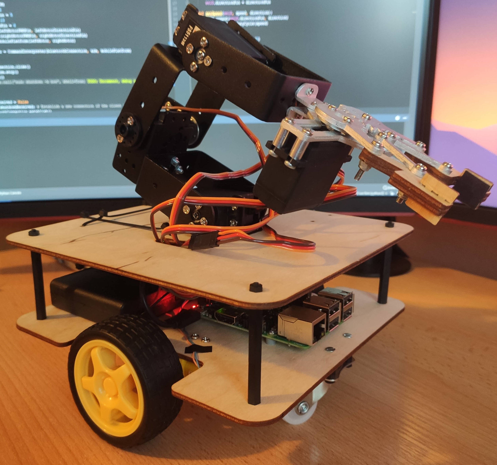
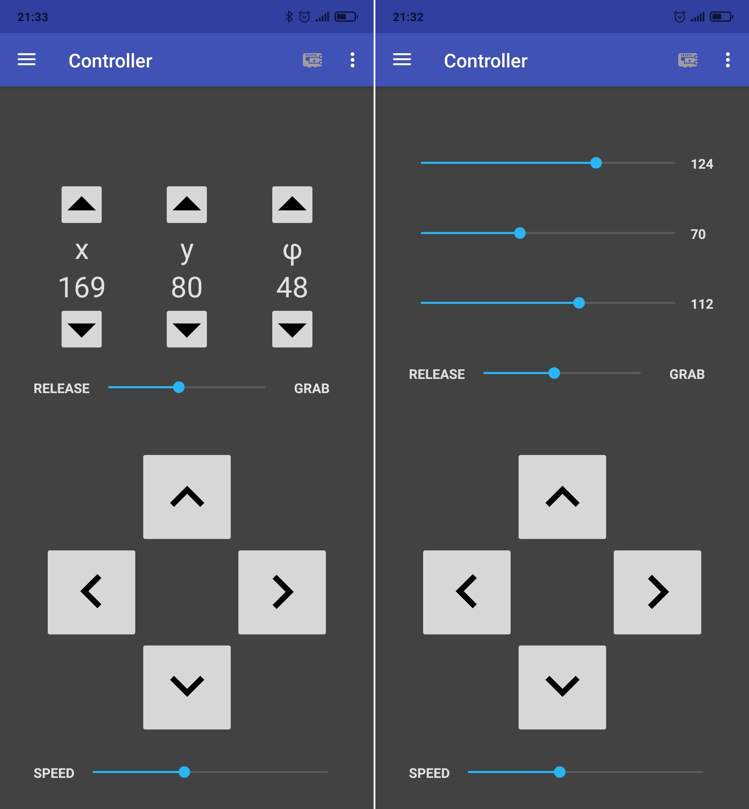
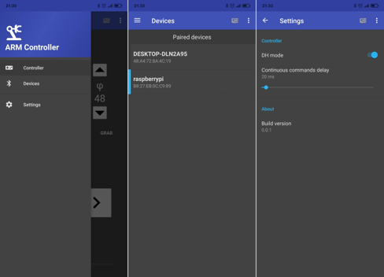

# ARM
ARM is a mobile robotic arm controlled by an Android app. This project is a subject of my BSc thesis.

Main features:
* controlled via Bluetooth
* reliable thanks to damage protection mechanisms
* can grab items
* ...or pinch someone
* goes __wroom__

## Built with
* [Jetbrains PyCharm](https://www.jetbrains.com/pycharm/)
* [Android Studio](https://developer.android.com/studio)
* [Matlab](https://www.mathworks.com/products/matlab.html)
* [Autodesk Inventor](https://www.autodesk.com/products/inventor/overview)
* [RaspberryPi](https://www.raspberrypi.org/)
* [Sourcetree](https://www.sourcetreeapp.com/)

## Pictures and screenshots

|  |
|:------------------------------------:|
|  |
|  |
